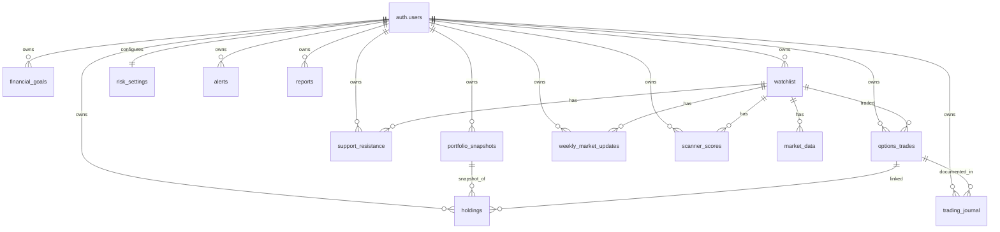

# Database Schema Reference — Phase 1

> Canonical business rules: [PROJECT_RULES.md](../../PROJECT_RULES.md)

## Apply Migrations

```bash
# Local (requires Supabase CLI)
supabase start
supabase db reset

# Remote
supabase link --project-ref <your-ref>
supabase db push
```

## Regenerate Types

```bash
npx supabase gen types typescript --local > types/database.ts
```

## Entity Relationship Diagram



## `options_trades` ↔ `watchlist`: Direct FK vs Logical

| Approach | How it works | Pros | Cons |
|----------|--------------|------|------|
| **Direct FK** (`watchlist_id`) | `options_trades.watchlist_id` → `watchlist(id)` | Referential integrity, fast joins, links trades to S/R, scanner scores, and market data for the same entry | Trade requires a watchlist entry first |
| **Logical only** (ticker match) | Join on `ticker` + `user_id` | No schema change, allows off-watchlist trades | No integrity, breaks if watchlist entry removed, ambiguous joins, poor analytics |

### Recommendation: **Direct FK + denormalized `ticker`**

This schema uses **both**:

- `watchlist_id` — **direct foreign key** (`ON DELETE RESTRICT`) for relational integrity and analytics joins
- `ticker` — **denormalized snapshot** at trade entry for immutable historical reports

**Why this wins for long-term reporting:**

1. **Stable join path** — `trade → watchlist → support_resistance / scanner_scores / market_data` without string matching
2. **Immutable history** — `ticker` on the trade row preserves the symbol even if the watchlist entry is later renamed or deactivated
3. **Integrity** — `RESTRICT` prevents deleting a watchlist ticker that has trade history; use `is_active = false` instead
4. **Cross-module analytics** — correlate P&L with scanner score at entry, manual S/R levels, and weekend rankings per watchlist entry
5. **Consistent hub model** — all ticker-scoped entities flow through `watchlist`, including trades

Ticker-only joins are useful for ad-hoc queries only; they should not be the primary relationship in the schema.

## Tables (13)

| # | Table | `user_id` → `auth.users(id)` | Purpose |
|---|-------|------------------------------|---------|
| 1 | `portfolio_snapshots` | Yes | Point-in-time portfolio metrics |
| 2 | `holdings` | Yes | Individual positions (live or snapshot-linked) |
| 3 | `financial_goals` | Yes | Income, allocation, and custom goals |
| 4 | `watchlist` | Yes | User ticker universe (hub for ticker-scoped data) |
| 5 | `market_data` | Via `watchlist_id` | Cached OHLCV per watchlist entry |
| 6 | `support_resistance` | Yes + `watchlist_id` | **Manual** Daily/Weekly S/R levels |
| 7 | `options_trades` | Yes + `watchlist_id` | Bull put, bear call, iron condor trades |
| 8 | `trading_journal` | Yes | Trade notes and lessons |
| 9 | `risk_settings` | Yes | TP/SL/allocation limits (one row per user) |
| 10 | `alerts` | Yes | Price, trade, risk notifications |
| 11 | `reports` | Yes | Generated performance reports |
| 12 | `weekly_market_updates` | Yes + `watchlist_id` | Weekend Market Review S/R snapshots |
| 13 | `scanner_scores` | Yes + `watchlist_id` | Multi-factor scanner rankings |

## Foreign Key Summary

### All `user_id` columns reference `auth.users(id)`

| Table | FK Column | References |
|-------|-----------|------------|
| `portfolio_snapshots` | `user_id` | `auth.users(id)` |
| `holdings` | `user_id` | `auth.users(id)` |
| `financial_goals` | `user_id` | `auth.users(id)` |
| `watchlist` | `user_id` | `auth.users(id)` |
| `support_resistance` | `user_id` | `auth.users(id)` |
| `options_trades` | `user_id` | `auth.users(id)` |
| `trading_journal` | `user_id` | `auth.users(id)` |
| `risk_settings` | `user_id` | `auth.users(id)` |
| `alerts` | `user_id` | `auth.users(id)` |
| `reports` | `user_id` | `auth.users(id)` |
| `weekly_market_updates` | `user_id` | `auth.users(id)` |
| `scanner_scores` | `user_id` | `auth.users(id)` |

### Watchlist hub relationships

| Child Table | FK Column | References | Cardinality |
|-------------|-----------|------------|-------------|
| `market_data` | `watchlist_id` | `watchlist(id)` | many per watchlist entry |
| `support_resistance` | `watchlist_id` | `watchlist(id)` | up to 2 (daily + weekly) |
| `weekly_market_updates` | `watchlist_id` | `watchlist(id)` | many per watchlist entry |
| `scanner_scores` | `watchlist_id` | `watchlist(id)` | many per watchlist entry |
| `options_trades` | `watchlist_id` | `watchlist(id)` | many per watchlist entry |

### Other foreign keys

| Table | FK Column | References |
|-------|-----------|------------|
| `holdings` | `snapshot_id` | `portfolio_snapshots(id)` |
| `holdings` | `linked_trade_id` | `options_trades(id)` |
| `trading_journal` | `trade_id` | `options_trades(id)` |

## Support & Resistance Policy

Per [PROJECT_RULES.md](../../PROJECT_RULES.md):

- `support_resistance` levels are **manual input only**
- No triggers, functions, or jobs auto-generate S/R values
- `market_data` stores OHLCV only — it does **not** derive S/R
- `scanner_scores.support_resistance_score` reads from user-entered levels (Phase 5)
- SQL `COMMENT ON TABLE` documents the manual-only policy on `support_resistance`
